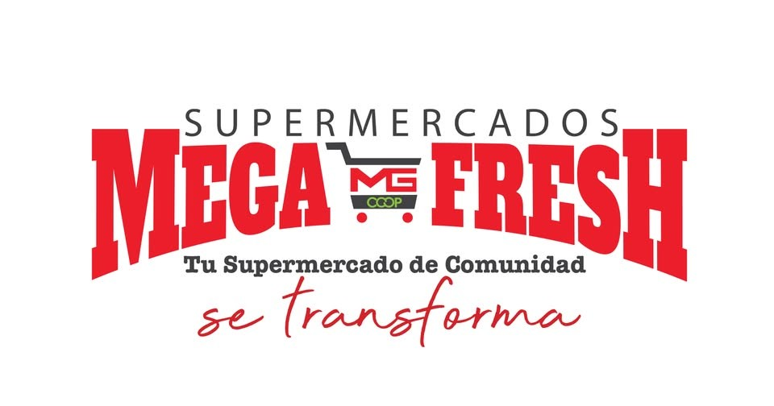
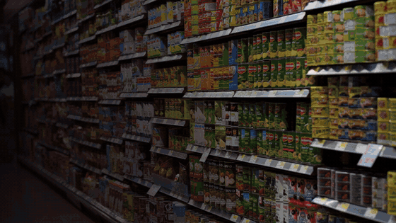
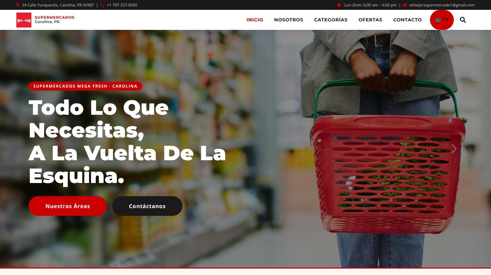
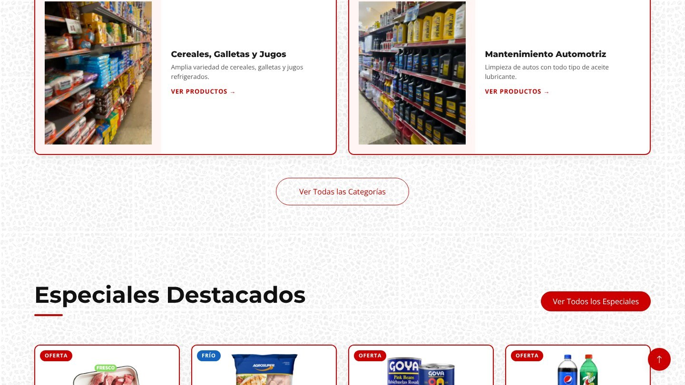
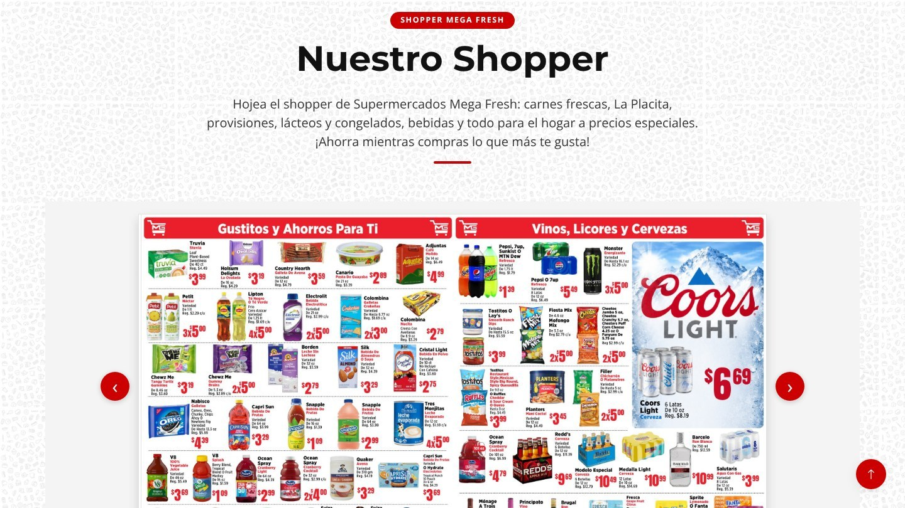
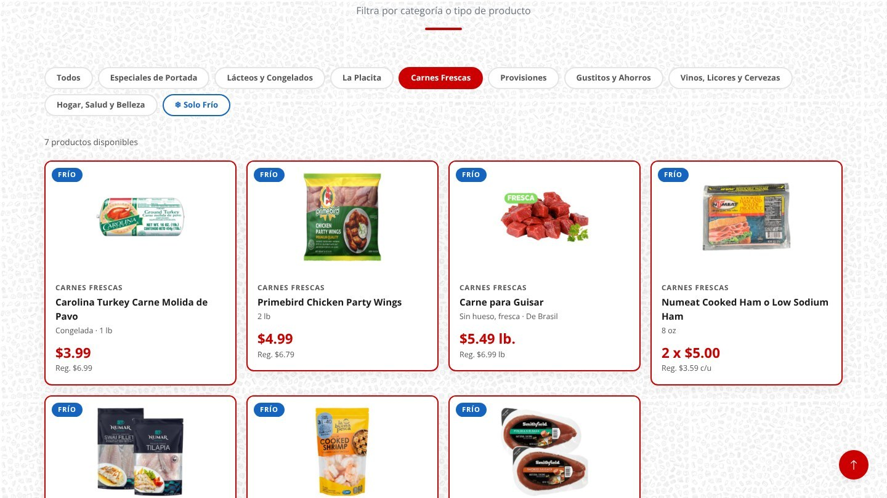
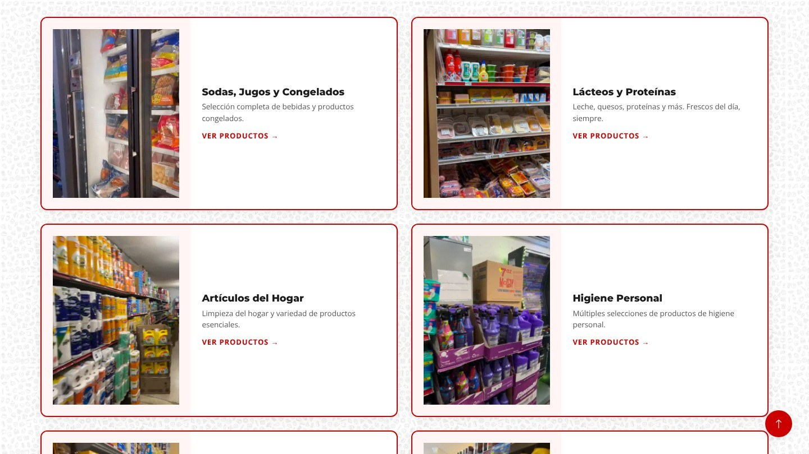
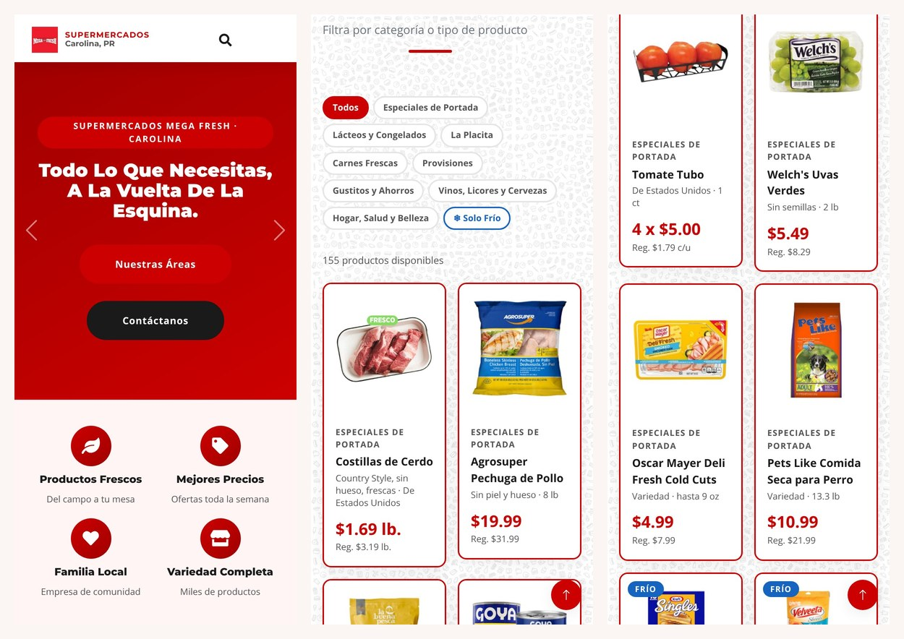
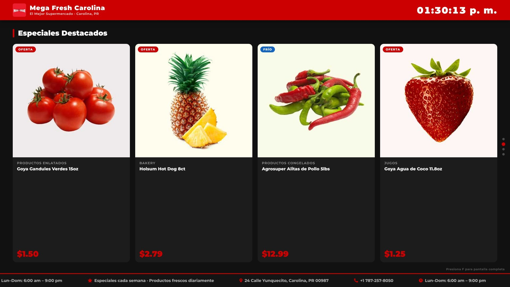

  

<h1 align="center">Mega Fresh Carolina — website</h1>

  <b>The website for a neighborhood supermarket in Carolina, Puerto Rico.</b> 
  Weekly specials, a flip-through shopper, every department, and a TV mode for the store's own screens.

  

  <a href="https://superelmejor.com"><b>Visit the live site: superelmejor.com</b></a>
  &nbsp;·&nbsp;
  <a href="https://ohitsgian21.github.io/megafresh-carolina-showcase/">Showcase page</a>
  &nbsp;·&nbsp;
  <a href="assets/promo.mp4">Video in full quality</a>

---

I designed and built this site for **Supermercados Mega Fresh Carolina** (El Mejor Supermercado). It is live at [superelmejor.com](https://superelmejor.com) and is written in Spanish for the store's customers.

> **This repository is a showcase.** It holds a video, screenshots and a landing page. The working repository for the site is private.

## Home

One scroll covers what a shopper needs: the week's specials, the store's departments, opening hours, customer reviews and how to get in touch. A search box in the header looks across every special and category from any page.

## Ofertas

- **A shopper you can flip through.** The Mega Fresh shopper is on the page as an eight-page booklet, with pages that turn.
- **155 specials, each with its photo.** Every item in the shopper is listed with its photo, size, sale price and regular price. Chips filter by department, and a "Solo Frío" toggle shows only chilled items.

## Categorías

Each department has a card with a short clip filmed in the actual aisle, so customers can see the store before they arrive.

## Mobile

Every page reflows for a phone, including the menu and search.

## Modo TV

A full-screen mode turns the site into signage for the store's own TVs: rotating slides of the week's specials, a live clock, and a ticker with the address, phone number and hours.

## Contact

A contact form sends messages, with optional attachments, straight to the store's inbox, next to the address, phone number, hours and a map.

---

  Designed and built by <b>Gianlexis Quiñones</b> 
  © 2026 Gianlexis Quiñones. All rights reserved. The page layout started from a free HTML Codex template and was reworked for the store. Store name, logo and product imagery belong to their owners and are shown with permission.

